Solución Dockerizada para gestionar los permisos de acceso en Google Drive. Integrada con las API de Google Drive y SendGrid, permite llevar un registro detallado de los cambios en los permisos de los documentos, evitando así la divulgación no autorizada de información.

<p float="center">
   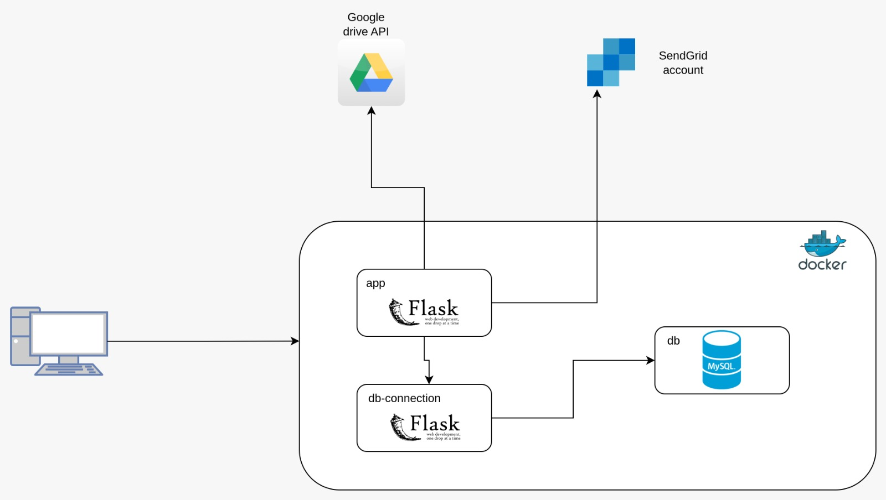
</p>
<br/>

<p float="center">
   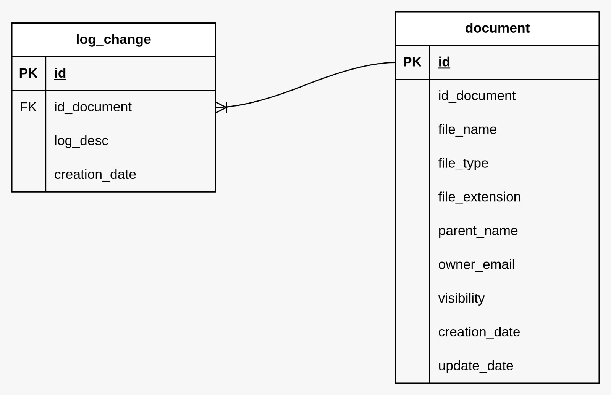
</p>
<br/>

## 📝 Contenido

1. [Pre Requisitos](#Pre-requisitos)
2. [Despliegue](#Despliegue)
3. [Uso](#Uso)


## Introduction


## Pre-requisitos

### Google

* Habilitar cuenta de google cloud platform https://console.cloud.google.com/ 
* Crear un proyecto o usar uno existente 
* Habilitar google drive API

<p float="center">
   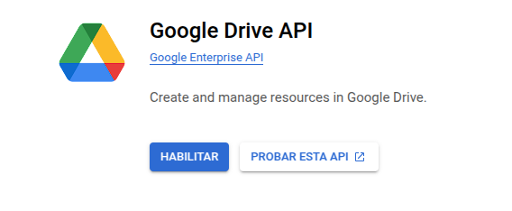
</p>
<br/>
<p float="center">
   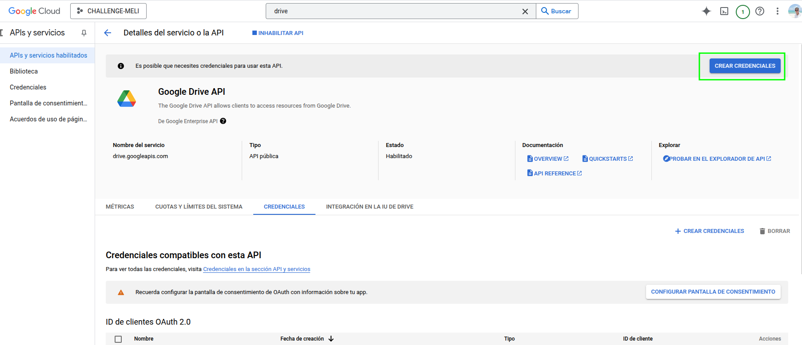

* Conceder los permisos necesarios para el acceso de la API a los datos de google drive

<p float="center">
   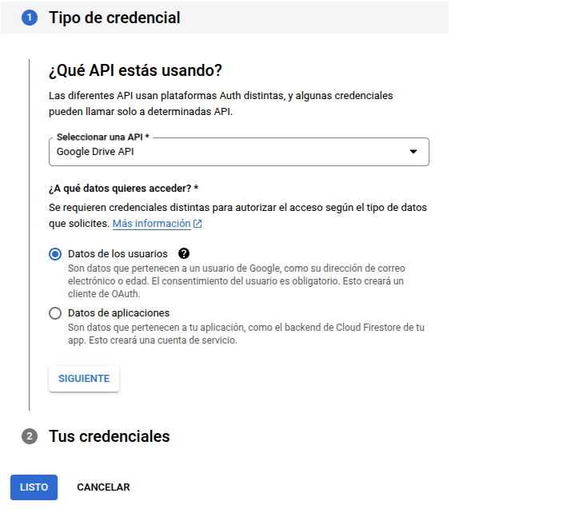
</p>
<br/>
<p float="center">
   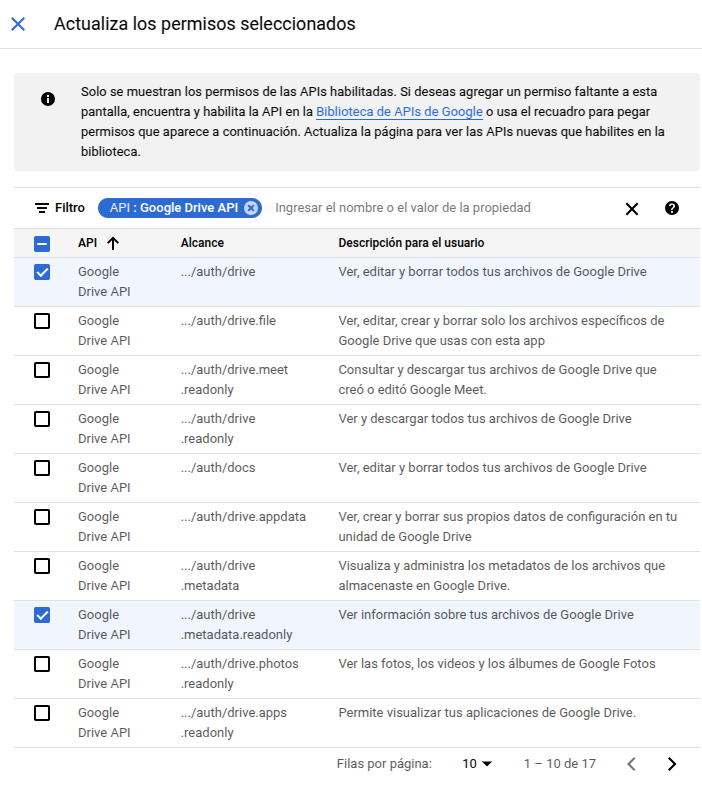
</p>
<br/>

* Crear credenciales OAuth 2.0 de tipo App de escritorio y descargar el archivo de credenciales

<p float="center">
   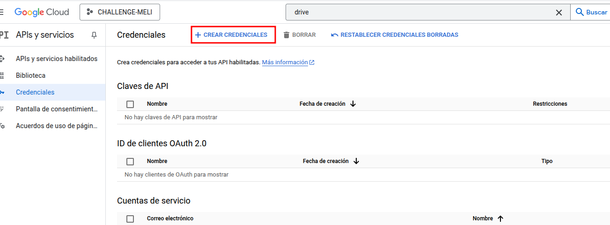
</p>
<br/>
<p float="center">
   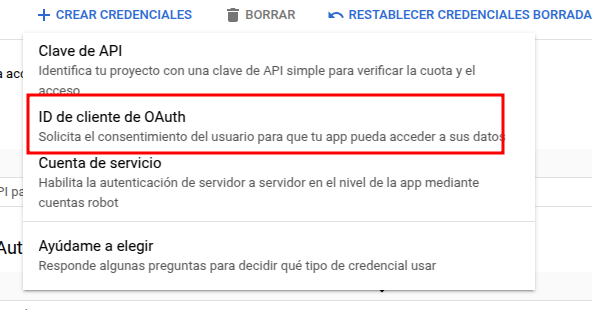
</p>
<br/>
<p float="center">
   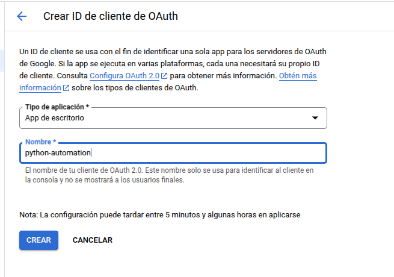
</p>
<br/>
<p float="center">
   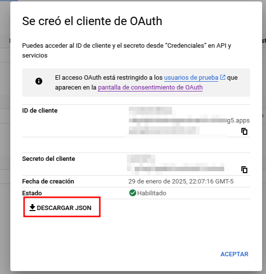
</p>
<br/>

* Dar consentiemiento y agregar los usuarios en ambiente de pruebas para poder autenticarse por OAuth 2.0

<p float="center">
   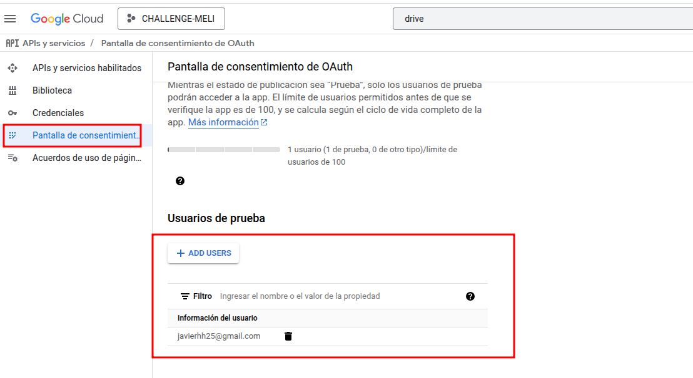
</p>
<br/>

* Detalles de uso, se podrán ver los métodos en uso y las transacciones de la API en el módulo de administración

<p float="center">
   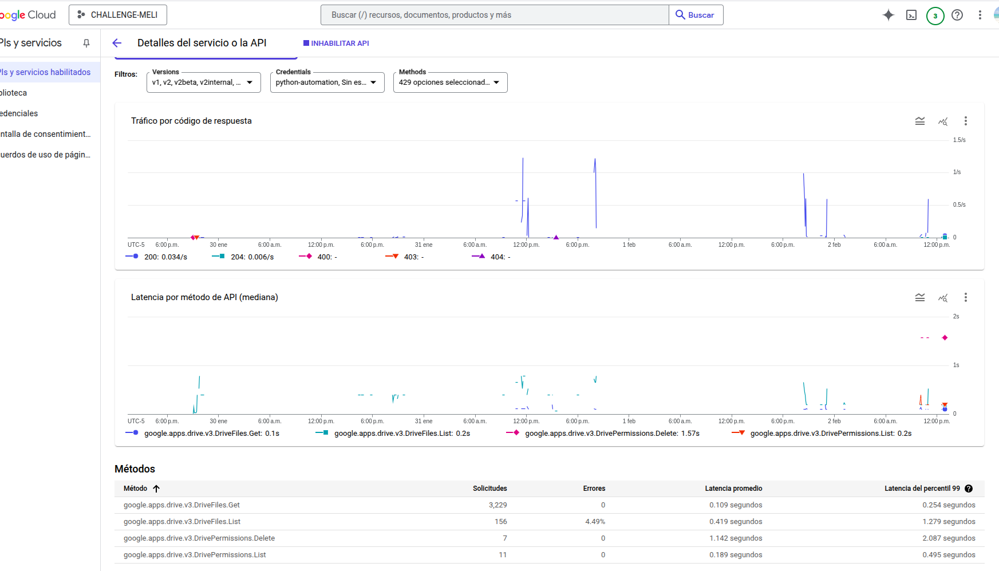
</p>
<br/>

### Documentación

* https://developers.google.com/drive/api/reference/rest/v3?apix=true&hl=es-419
* https://developers.google.com/drive/api/quickstart/python

### SendGrid

* Crear cuenta SendGrid https://login.sendgrid.com/unified_login/start?screen_hint=signup

<p float="center">
   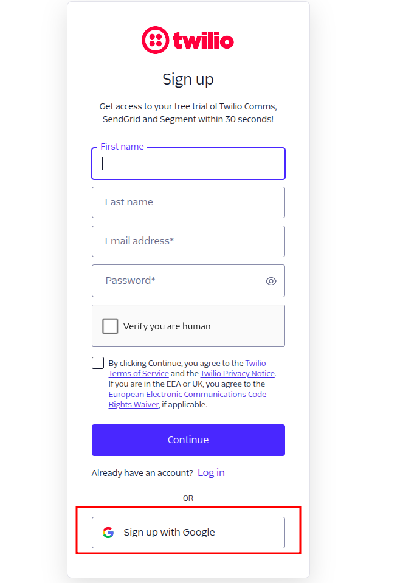
</p>
<br/>

* Validar tipo de cuenta

<p float="center">
   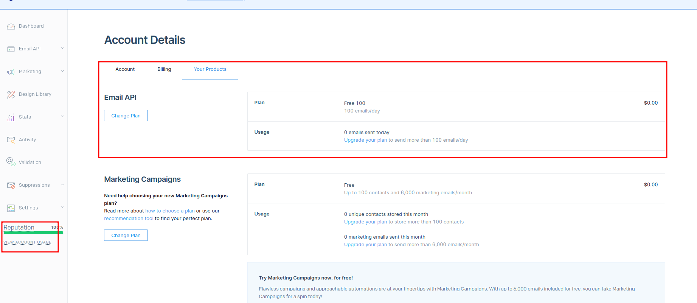
</p>
<br/>

* Verificar el remitente

<p float="center">
   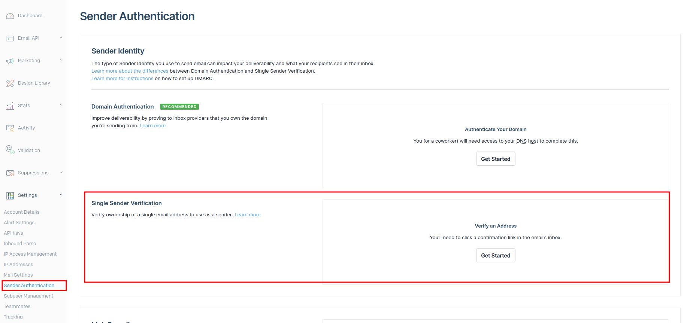
</p>
<br/>

<p float="center">
   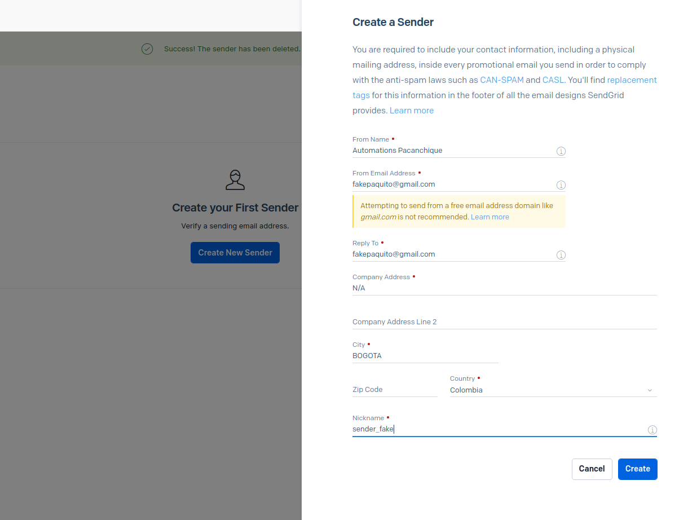
</p>
<br/>

<p float="center">
   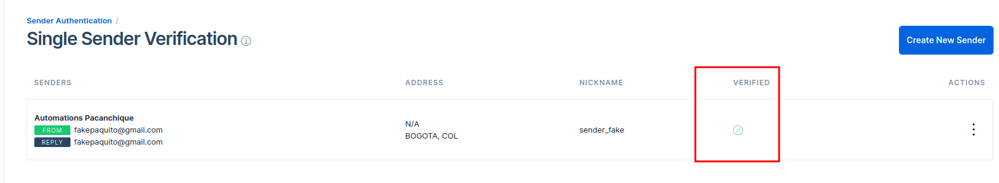
</p>
<br/>

* Configurar API KEY con permisos restringidos

<p float="center">
   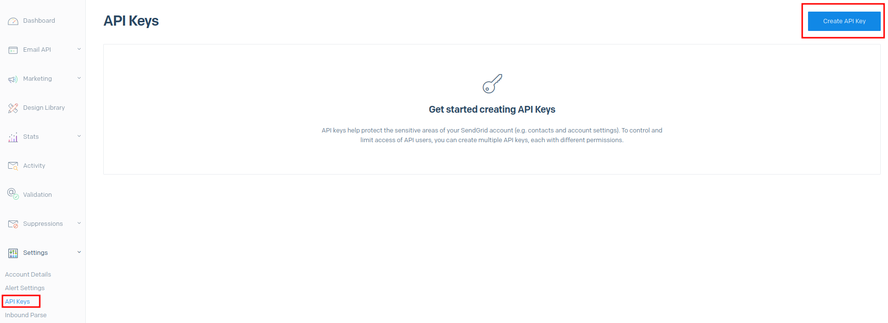
</p>
<br/>

<p float="center">
   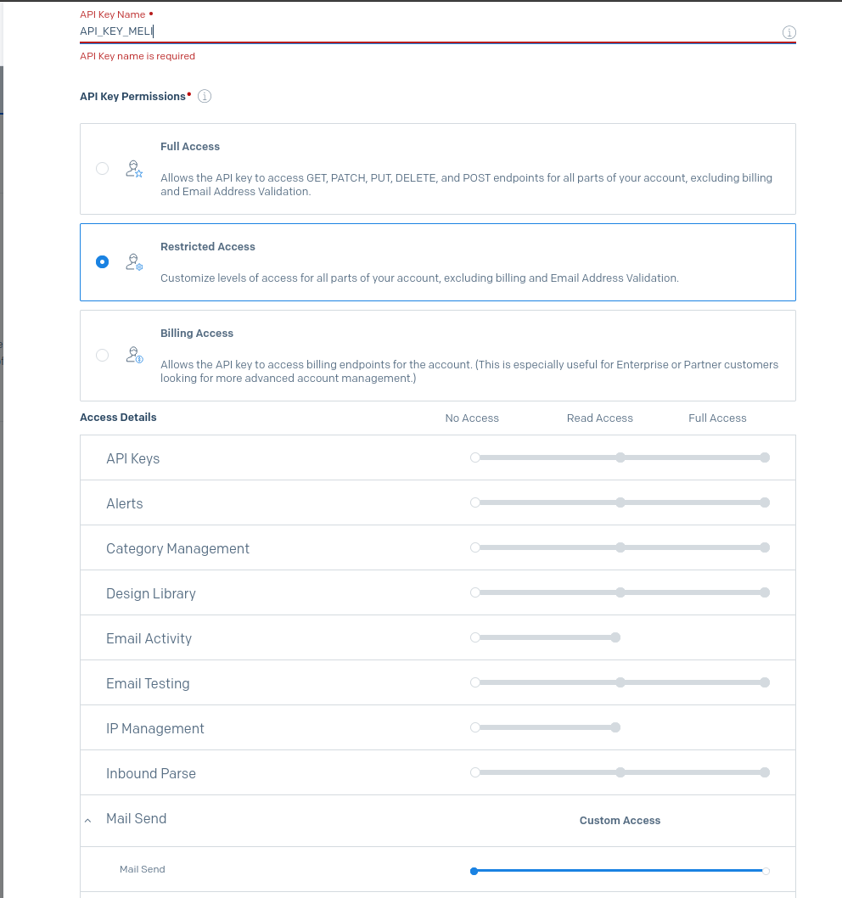
</p>
<br/>

### Docker

* Instalar Docker | Unix (https://docs.docker.com/engine/install/), Windows (https://docs.docker.com/desktop/setup/install/windows-install/)

## Despliegue

### Credenciales Google

* Es necesario renombrar el archivo de las credenciales de google que se descargaron en los pre-requisitos y debe quedar con el nombre credentials.json en la ruta ./app/credentials.json

### Ambientes

* Ruta ./secrets/.env: En este archivo se debén ingresar las variables para el despliegue de la base de datos, debe quedar de la siguiente forma 

```sh
    MYSQL_ROOT_PASSWORD=REEMPLAZA_POR_OTRO_VALOR
    MYSQL_DATABASE=REEMPLAZA_POR_OTRO_VALOR
    MYSQL_USER=REEMPLAZA_POR_OTRO_VALOR
    MYSQL_PASSWORD=REEMPLAZA_POR_OTRO_VALOR 
``` 

* Ruta ./app/deploy/secrets/.env: En este archivo se debe ingresar la variable para poder coonectar con el servicio de envío de correos 

```sh
SENDGRID_API_KEY=LLAVE_GENERADA_POR_SENDGRID
``` 

* Ruta ./db-connector/deploy/secrets/.env: En este archivo se debén ingresar las variables para conectarse a la base de datos, deben ser las mismas de la ruta ./secrets.env a excepción de la variable  MYSQL_ROOT_PASSWORD

```sh
    MYSQL_DATABASE=REEMPLAZA_POR_OTRO_VALOR
    MYSQL_USER=REEMPLAZA_POR_OTRO_VALOR
    MYSQL_PASSWORD=REEMPLAZA_POR_OTRO_VALOR
    MYSQL_HOST=db-challenge 
``` 

* Crear red en docker: 
```sh 
docker network create challenge-meli-net 
```
* Ejecutar la instrucción 
En linux
```sh 
sudo docker compose up --build -d
 ``` 
En Windows

```sh
docker compose up app --build -d  
```
* Revisar que estén corriendo los 3 containers ``` docker ps ```


## Uso

* Ingresar a la URL: https://localhost:5000/ y continuar con el flujo de la aplicación

### Inicio de sesión OAuth 2.0 

* Iniciar sesión
<p float="center">
   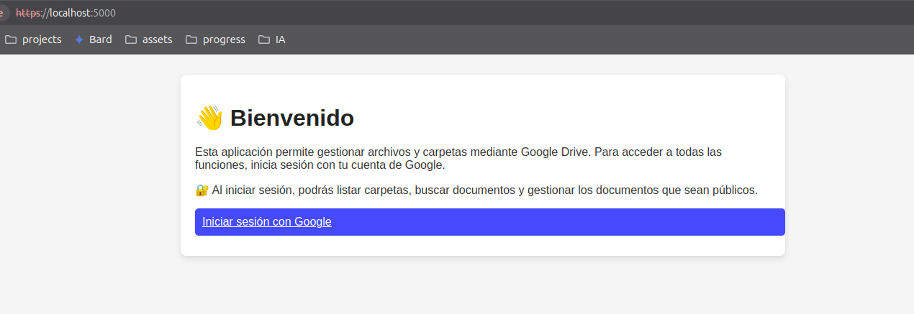
</p>
<br/>
* Seleccionar la cuenta que se haya configurado en GCP
<p float="center">
   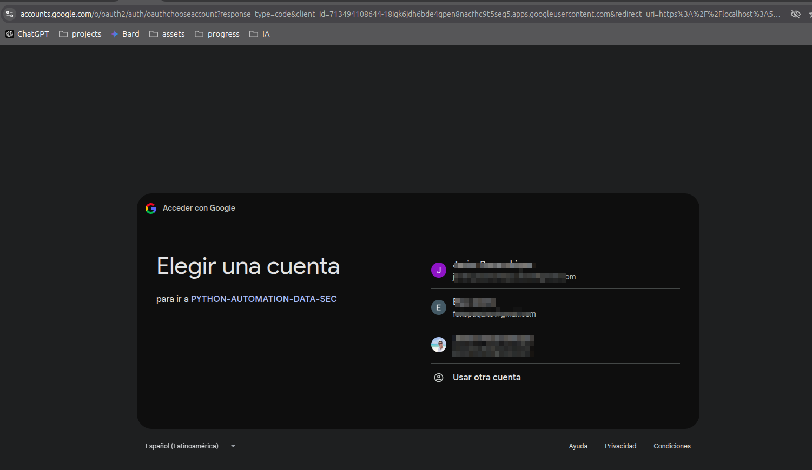
</p>
<br/>

* Dar clic en continuar indicando que si es una aplicación en desarrollo 
<p float="center">
   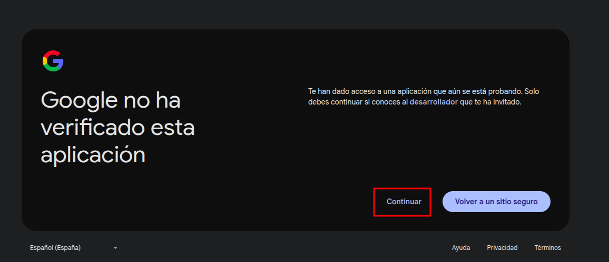
</p>
<br/>

* Autorizar el acceso
<p float="center">
   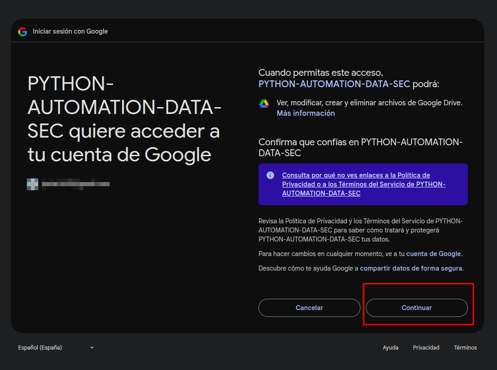
</p>
<br/>

* Finalmente se podrá ver el panel de control con las acciones necesarias para gestionar los permisos
<p float="center">
   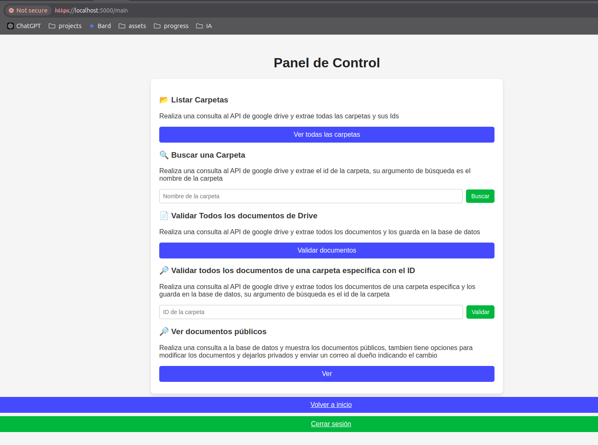
</p>
<br/>